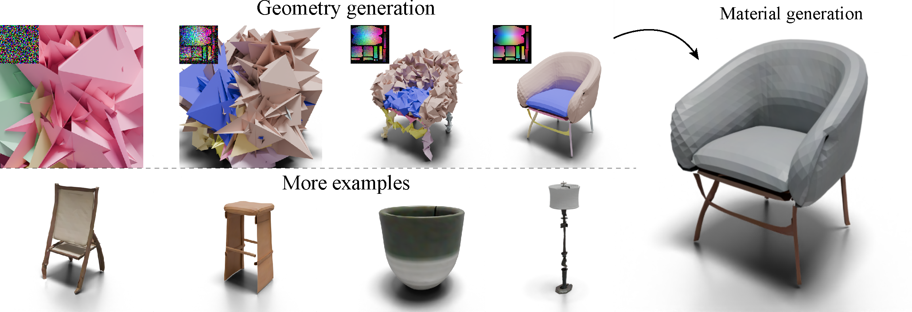
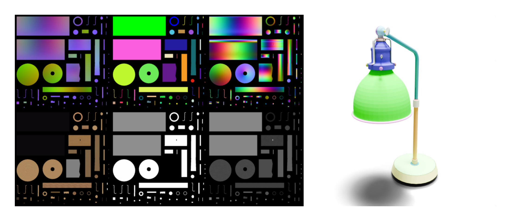

# An Object is Worth 64x64 Pixels: Generating 3D Object via Image Diffusion

<a href="https://pytorch.org/"></a>
<a href="https://pytorchlightning.ai/"></a>
<a href="https://wandb.ai/site"></a>

**This repository is the official repository of the paper, *An Object is Worth 64x64 Pixels: Generating 3D Object via Image Diffusion*.**

[Xinggaung Yan](http://yanxg.art)<sup>1</sup>,
[Han-Hung Lee](https://hanhung.github.io/)<sup>1</sup>,
[Ziyu Wan](http://raywzy.com/)<sup>2</sup>,
[Angel X. Chang](https://angelxuanchang.github.io/)<sup>1,3</sup>

<sup>1</sup>Simon Fraser University, <sup>2</sup>City University of Hong Kong, <sup>3</sup>Canada-CIFAR AI Chair, Amii


### [Project Page](https://omages.github.io/) | [Paper (ArXiv)](https://arxiv.org/abs/2408.03178) | [Twitter thread](https://x.com/yan_xg/status/1825830023636631990)




<!-- https://user-images.githubusercontent.com/5100481/150949433-40d84ed1-0a8d-4ae4-bd53-8662ebd669fe.mp4 -->


https://github.com/user-attachments/assets/76fb3b27-2f77-4368-b922-b23b2325ddad


## Installation
The code is tested in docker enviroment [pytorch/pytorch:2.0.1-cuda11.7-cudnn8-devel](https://hub.docker.com/layers/pytorch/pytorch/2.0.1-cuda11.7-cudnn8-devel/images/sha256-4f66166dd757752a6a6a9284686b4078e92337cd9d12d2e14d2d46274dfa9048?context=explore).
The following are instructions for setting up the environment in a Linux system from scratch.

First, clone this repository:

      git clone git@github.com:3dlg-hcvc/omages.git

Then, create a mamba environment with the yaml file. (Sometimes the conda is a bit slow to solve the dependencies, so [mamba](https://mamba.readthedocs.io/en/latest/installation/mamba-installation.html) is recommended). You could also just use conda as well.

      mamba env create -f environment.yaml
      mamba activate dlt

## Download data and checkpoints

We use the [ABO](https://amazon-berkeley-objects.s3.amazonaws.com/index.html) dataset and process its shapes into omages. The processed data is stored on [huggingface](https://huggingface.co/datasets/3dlg-hcvc/omages_ABO).

To download the 1024 resolution data (~88GB), please run `python setup/download_omages1024.py` and then untar the downloaded file to `datasets/ABO/omages/`. To preview and download the individual data, please check the [data](https://huggingface.co/datasets/3dlg-hcvc/omages_ABO/tree/main/data) folder on huggingface.

We have prepared a downsampled version of the dataset (<1GB) for training. To obtain it please run `python setup/download_omages64.py`.

To download the checkpoints, please run `python setup/download_ckpts.py`

## Previewing the omages data
We highly recommend you to check the `notebooks/preview_omages.ipynb` or `notebooks/preview_omages.py` file for a better understanding of the omage representation. The following figures shows a preview of the B0742FHDJF lamp *encoded* from .glb shape to 1024 resolution omage and *decoded* back to *.glb*. The 2D images on the left are position map, patch segmentation, object space normal map, albedo, metalness and roughness maps.




## Usage

After the data and checkpoints are downloaded, you can run this command to run the full pipeline to first generate geometry (null2geo) with the DiT model and then generate the material (geo2mat) with pytorch-imagen.


      python -m src.trainer --opts src/models/omages64_DiT/cfgs/pipeline_N2G2M.yaml --gpus 0 --mode 'test'
      # if you want to utilize multi-gpu to generate multiple objects at the same time:
      python -m src.trainer --opts src/models/omages64_DiT/cfgs/pipeline_N2G2M.yaml --gpus 0 1 2 3 --mode 'test'


The generated data and visualizations will be placed in `experiments/omages64/pipeline_N2G2M/results/N2G2MCallback/`. By default, the `pipeline_N2G2M.yaml` file is configured to generate chairs. You can change it according to the category names listed in `src/data/abo_datasets/omg_dataset.py`.

To train and test the null2geo and geo2mat model, please use the following commands:

      # Train null2geo
      python -m src.trainer --opts src/models/omages64_DiT/cfgs/null2geo.yaml --gpus 0
      # Visualize and test null2geo
      python -m src.trainer --opts src/models/omages64_DiT/cfgs/null2geo.yaml --gpus 0 --mode 'test'

      # Train geo2mat
      python -m src.trainer --opts src/models/omages64_DiT/cfgs/geo2mat_imagen.yaml --gpus 0
      # Visualize and test geo2mat
      python -m src.trainer --opts src/models/omages64_DiT/cfgs/geo2mat_imagen.yaml --gpus 0 --mode 'test'


## Frequently Asked Questions

What's the core difference between UV map and omage?

Omage, as a kind of multi-chart geometry image, is focused on *auto-encoding* geometry and textures altogether, where commonly used UV-maps only focuses on retrieving textures from 2D.

## :hourglass_flowing_sand: Updates

- [x] ~~Source code and data, coming soon!~~
- [ ] Higher-resolution omages generation.
- [ ] Cleanup the omage encoder script that converts 3D objects into omages.

## :takeout_box: Takeaways

1. Omage encodes geometry as a (R,R,3+1) image, which is essentially a 16-bit RGBA PNG!

2. PBR material is encoded in another (R,R,8) image.
So three PNGs will give you a realistic 3D object.

3. You can use image generation models to generate 3D objects, one image for one object!

4. Discrete patch structures emerge out of continuous noise during the denoising process.

5. Patch segmentation comes naturally from 2D disconnected components, no instance labels needed!

6. Irregular connectivity & complex topology?
No worries, all encoded in a regular image.

7. Change your object resolution by just rescaling the omage!

8. Generated shapes come with UV maps—no unwrapping required.

And there’s even more to discover!

## :notebook_with_decorative_cover: Citation

If you find our work useful for your research, please consider citing the following papers :)

```bibtex
@misc{yan2024omages64,
  title={An Object is Worth 64x64 Pixels: Generating 3D Object via Image Diffusion}, 
  author={Xingguang Yan and Han-Hung Lee and Ziyu Wan and Angel X. Chang},
  year={2024},
  eprint={2408.03178},
  archivePrefix={arXiv},
  url={https://arxiv.org/abs/2408.03178}, 
}
```

## :email: Contact

This repo is currently maintained by Xingguang ([@qheldiv](https://github.com/qheldiv)) and is for academic research use only. Discussions and questions are welcome via qheldiv@gmail.com. 
